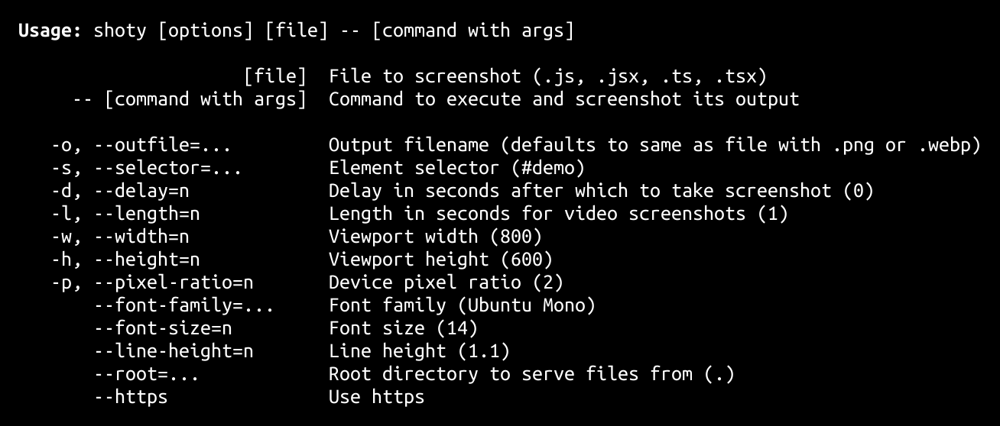

<h1>
shoty <a href="https://npmjs.org/package/shoty"></a> <a href="src"></a> <a href="LICENSE"></a>
</h1>

<p></p>

animated and static element screenshots

<h4>
<table><tr><td title="Triple click to select and copy paste">
<code>npm i shoty -g</code>
</td><td title="Triple click to select and copy paste">
<code>pnpm add shoty -g</code>
</td><td title="Triple click to select and copy paste">
<code>yarn global add shoty</code>
</td></tr></table>
</h4>

## CLI

<p></p>
<p>

</p>

## Examples

<details id="example$node" title="node" open><summary><span><a href="#example$node">#</a></span>  <code><strong>node</strong></code></summary>  <ul>    <details id="source$node" title="node source code" open><summary><span><a href="#source$node">#</a></span>  <code><strong>view source</strong></code></summary>  <a href="example/node.ts">example/node.ts</a>  <p>

```ts
import { Options, run } from 'shoty'

run(
  new Options({
    file: 'web.ts',
    root: __dirname,
  })
).then(() => console.log('complete'))
```

</p>
</details></ul></details><details id="example$web" title="web" open><summary><span><a href="#example$web">#</a></span>  <code><strong>web</strong></code></summary>  <ul><p></p>  </img>    <details id="source$web" title="web source code" ><summary><span><a href="#source$web">#</a></span>  <code><strong>view source</strong></code></summary>  <a href="example/web.ts">example/web.ts</a>  <p>

```ts
document.body.innerHTML = `<h1 id="demo">hello world!</h1>`
```

</p>
</details></ul></details>

## API

<p>  <details id="Options$58" title="Class" ><summary><span><a href="#Options$58">#</a></span>  <code><strong>Options</strong></code>    </summary>  <a href="src/vite-open/dist/types/index.d.ts#L8">src/vite-open/dist/types/index.d.ts#L8</a>  <ul>        <p>  <details id="constructor$59" title="Constructor" ><summary><span><a href="#constructor$59">#</a></span>  <code><strong>constructor</strong></code><em>()</em>    </summary>    <ul>    <p>  <details id="new Options$60" title="ConstructorSignature" ><summary><span><a href="#new Options$60">#</a></span>  <code><strong>new Options</strong></code><em>()</em>    </summary>    <ul><p><a href="#Options$58">Options</a></p>        </ul></details></p>    </ul></details><details id="debugging$67" title="Property" ><summary><span><a href="#debugging$67">#</a></span>  <code><strong>debugging</strong></code>    </summary>  <a href="src/vite-open/dist/types/index.d.ts#L15">src/vite-open/dist/types/index.d.ts#L15</a>  <ul><p>string</p>        </ul></details><details id="debuggingThis$68" title="Property" ><summary><span><a href="#debuggingThis$68">#</a></span>  <code><strong>debuggingThis</strong></code>    </summary>  <a href="src/vite-open/dist/types/index.d.ts#L16">src/vite-open/dist/types/index.d.ts#L16</a>  <ul><p>boolean</p>        </ul></details><details id="file$61" title="Property" ><summary><span><a href="#file$61">#</a></span>  <code><strong>file</strong></code>    </summary>  <a href="src/vite-open/dist/types/index.d.ts#L9">src/vite-open/dist/types/index.d.ts#L9</a>  <ul><p>string</p>        </ul></details><details id="https$63" title="Property" ><summary><span><a href="#https$63">#</a></span>  <code><strong>https</strong></code>    </summary>  <a href="src/vite-open/dist/types/index.d.ts#L11">src/vite-open/dist/types/index.d.ts#L11</a>  <ul><p>boolean</p>        </ul></details><details id="jsx$64" title="Property" ><summary><span><a href="#jsx$64">#</a></span>  <code><strong>jsx</strong></code>    </summary>  <a href="src/vite-open/dist/types/index.d.ts#L12">src/vite-open/dist/types/index.d.ts#L12</a>  <ul><p>string</p>        </ul></details><details id="log$70" title="Property" ><summary><span><a href="#log$70">#</a></span>  <code><strong>log</strong></code>    </summary>  <a href="src/vite-open/dist/types/index.d.ts#L18">src/vite-open/dist/types/index.d.ts#L18</a>  <ul><p><details id="__type$71" title="Function" ><summary><span><a href="#__type$71">#</a></span>  <em>(args)</em>    </summary>    <ul>    <p>    <details id="args$73" title="Parameter" ><summary><span><a href="#args$73">#</a></span>  <code><strong>args</strong></code>    </summary>    <ul><p>unknown  []</p>        </ul></details>  <p><strong></strong><em>(args)</em>  &nbsp;=&gt;  <ul>void</ul></p></p>    </ul></details></p>        </ul></details><details id="noForce$66" title="Property" ><summary><span><a href="#noForce$66">#</a></span>  <code><strong>noForce</strong></code>    </summary>  <a href="src/vite-open/dist/types/index.d.ts#L14">src/vite-open/dist/types/index.d.ts#L14</a>  <ul><p>boolean</p>        </ul></details><details id="noOpen$65" title="Property" ><summary><span><a href="#noOpen$65">#</a></span>  <code><strong>noOpen</strong></code>    </summary>  <a href="src/vite-open/dist/types/index.d.ts#L13">src/vite-open/dist/types/index.d.ts#L13</a>  <ul><p>boolean</p>        </ul></details><details id="quiet$69" title="Property" ><summary><span><a href="#quiet$69">#</a></span>  <code><strong>quiet</strong></code>    </summary>  <a href="src/vite-open/dist/types/index.d.ts#L17">src/vite-open/dist/types/index.d.ts#L17</a>  <ul><p>boolean</p>        </ul></details><details id="responses$75" title="Property" ><summary><span><a href="#responses$75">#</a></span>  <code><strong>responses</strong></code>    </summary>  <a href="src/vite-open/dist/types/index.d.ts#L20">src/vite-open/dist/types/index.d.ts#L20</a>  <ul><p><span>Record</span>&lt;string, {<p>  <details id="content$78" title="Property" ><summary><span><a href="#content$78">#</a></span>  <code><strong>content</strong></code>    </summary>  <a href="src/vite-open/dist/types/index.d.ts#L22">src/vite-open/dist/types/index.d.ts#L22</a>  <ul><p>string</p>        </ul></details><details id="type$77" title="Property" ><summary><span><a href="#type$77">#</a></span>  <code><strong>type</strong></code>    </summary>  <a href="src/vite-open/dist/types/index.d.ts#L21">src/vite-open/dist/types/index.d.ts#L21</a>  <ul><p>string</p>        </ul></details><details id="fn$79" title="Method" ><summary><span><a href="#fn$79">#</a></span>  <code><strong>fn</strong></code><em>(server, req, res, next)</em>    </summary>  <a href="src/vite-open/dist/types/index.d.ts#L23">src/vite-open/dist/types/index.d.ts#L23</a>  <ul>    <p>    <details id="server$81" title="Parameter" ><summary><span><a href="#server$81">#</a></span>  <code><strong>server</strong></code>    </summary>    <ul><p><span>ViteDevServer</span></p>        </ul></details><details id="req$82" title="Parameter" ><summary><span><a href="#req$82">#</a></span>  <code><strong>req</strong></code>    </summary>    <ul><p><span>IncomingMessage</span></p>        </ul></details><details id="res$83" title="Parameter" ><summary><span><a href="#res$83">#</a></span>  <code><strong>res</strong></code>    </summary>    <ul><p><span>ServerResponse</span></p>        </ul></details><details id="next$84" title="Parameter" ><summary><span><a href="#next$84">#</a></span>  <code><strong>next</strong></code>    </summary>    <ul><p><span>NextFunction</span></p>        </ul></details>  <p><strong>fn</strong><em>(server, req, res, next)</em>  &nbsp;=&gt;  <ul>void</ul></p></p>    </ul></details></p>}&gt;</p>        </ul></details><details id="root$62" title="Property" ><summary><span><a href="#root$62">#</a></span>  <code><strong>root</strong></code>    </summary>  <a href="src/vite-open/dist/types/index.d.ts#L10">src/vite-open/dist/types/index.d.ts#L10</a>  <ul><p>string</p>        </ul></details><details id="virtual$74" title="Property" ><summary><span><a href="#virtual$74">#</a></span>  <code><strong>virtual</strong></code>    </summary>  <a href="src/vite-open/dist/types/index.d.ts#L19">src/vite-open/dist/types/index.d.ts#L19</a>  <ul><p><span>Record</span>&lt;string, any&gt;</p>        </ul></details><details id="viteOptions$85" title="Property" ><summary><span><a href="#viteOptions$85">#</a></span>  <code><strong>viteOptions</strong></code>    </summary>  <a href="src/vite-open/dist/types/index.d.ts#L25">src/vite-open/dist/types/index.d.ts#L25</a>  <ul><p><span>Partial</span>&lt;<span>InlineConfig</span>&gt;</p>        </ul></details></p></ul></details><details id="Options$1" title="Class" ><summary><span><a href="#Options$1">#</a></span>  <code><strong>Options</strong></code>    </summary>  <a href="src/runner.ts#L8">src/runner.ts#L8</a>  <ul>        <p>  <details id="constructor$2" title="Constructor" ><summary><span><a href="#constructor$2">#</a></span>  <code><strong>constructor</strong></code><em>(options)</em>    </summary>  <a href="src/runner.ts#L37">src/runner.ts#L37</a>  <ul>    <p>  <details id="new Options$3" title="ConstructorSignature" ><summary><span><a href="#new Options$3">#</a></span>  <code><strong>new Options</strong></code><em>()</em>    </summary>    <ul><p><a href="#Options$1">Options</a></p>      <p>  <details id="options$4" title="Parameter" ><summary><span><a href="#options$4">#</a></span>  <code><strong>options</strong></code>  <span><span>&nbsp;=&nbsp;</span>  <code>{}</code></span>  </summary>    <ul><p><span>Partial</span>&lt;<a href="#Options$1">Options</a>&gt;</p>        </ul></details></p>  </ul></details></p>    </ul></details><details id="command$6" title="Property" ><summary><span><a href="#command$6">#</a></span>  <code><strong>command</strong></code>  <span><span>&nbsp;=&nbsp;</span>  <code>[]</code></span>  </summary>  <a href="src/runner.ts#L11">src/runner.ts#L11</a>  <ul><p>string  []</p>        </ul></details><details id="delay$9" title="Property" ><summary><span><a href="#delay$9">#</a></span>  <code><strong>delay</strong></code>  <span><span>&nbsp;=&nbsp;</span>  <code>0</code></span>  </summary>  <a href="src/runner.ts#L17">src/runner.ts#L17</a>  <ul><p>number</p>        </ul></details><details id="file$5" title="Property" ><summary><span><a href="#file$5">#</a></span>  <code><strong>file</strong></code>  <span><span>&nbsp;=&nbsp;</span>  <code>''</code></span>  </summary>  <a href="src/runner.ts#L9">src/runner.ts#L9</a>  <ul><p>string</p>        </ul></details><details id="fontFamily$14" title="Property" ><summary><span><a href="#fontFamily$14">#</a></span>  <code><strong>fontFamily</strong></code>  <span><span>&nbsp;=&nbsp;</span>  <code>'Ubuntu Mono'</code></span>  </summary>  <a href="src/runner.ts#L27">src/runner.ts#L27</a>  <ul><p>string</p>        </ul></details><details id="fontSize$15" title="Property" ><summary><span><a href="#fontSize$15">#</a></span>  <code><strong>fontSize</strong></code>  <span><span>&nbsp;=&nbsp;</span>  <code>14</code></span>  </summary>  <a href="src/runner.ts#L29">src/runner.ts#L29</a>  <ul><p>number</p>        </ul></details><details id="height$12" title="Property" ><summary><span><a href="#height$12">#</a></span>  <code><strong>height</strong></code>  <span><span>&nbsp;=&nbsp;</span>  <code>600</code></span>  </summary>  <a href="src/runner.ts#L23">src/runner.ts#L23</a>  <ul><p>number</p>        </ul></details><details id="https$18" title="Property" ><summary><span><a href="#https$18">#</a></span>  <code><strong>https</strong></code>  <span><span>&nbsp;=&nbsp;</span>  <code>false</code></span>  </summary>  <a href="src/runner.ts#L35">src/runner.ts#L35</a>  <ul><p>boolean</p>        </ul></details><details id="length$10" title="Property" ><summary><span><a href="#length$10">#</a></span>  <code><strong>length</strong></code>  <span><span>&nbsp;=&nbsp;</span>  <code>1</code></span>  </summary>  <a href="src/runner.ts#L19">src/runner.ts#L19</a>  <ul><p>number</p>        </ul></details><details id="lineHeight$16" title="Property" ><summary><span><a href="#lineHeight$16">#</a></span>  <code><strong>lineHeight</strong></code>  <span><span>&nbsp;=&nbsp;</span>  <code>1.1</code></span>  </summary>  <a href="src/runner.ts#L31">src/runner.ts#L31</a>  <ul><p>number</p>        </ul></details><details id="outfile$7" title="Property" ><summary><span><a href="#outfile$7">#</a></span>  <code><strong>outfile</strong></code>  <span><span>&nbsp;=&nbsp;</span>  <code>''</code></span>  </summary>  <a href="src/runner.ts#L13">src/runner.ts#L13</a>  <ul><p>string</p>        </ul></details><details id="pixelRatio$13" title="Property" ><summary><span><a href="#pixelRatio$13">#</a></span>  <code><strong>pixelRatio</strong></code>  <span><span>&nbsp;=&nbsp;</span>  <code>2</code></span>  </summary>  <a href="src/runner.ts#L25">src/runner.ts#L25</a>  <ul><p>number</p>        </ul></details><details id="root$17" title="Property" ><summary><span><a href="#root$17">#</a></span>  <code><strong>root</strong></code>  <span><span>&nbsp;=&nbsp;</span>  <code>'.'</code></span>  </summary>  <a href="src/runner.ts#L33">src/runner.ts#L33</a>  <ul><p>string</p>        </ul></details><details id="selector$8" title="Property" ><summary><span><a href="#selector$8">#</a></span>  <code><strong>selector</strong></code>  <span><span>&nbsp;=&nbsp;</span>  <code>'#demo'</code></span>  </summary>  <a href="src/runner.ts#L15">src/runner.ts#L15</a>  <ul><p>string</p>        </ul></details><details id="width$11" title="Property" ><summary><span><a href="#width$11">#</a></span>  <code><strong>width</strong></code>  <span><span>&nbsp;=&nbsp;</span>  <code>800</code></span>  </summary>  <a href="src/runner.ts#L21">src/runner.ts#L21</a>  <ul><p>number</p>        </ul></details></p></ul></details><details id="AnimationOptions$22" title="TypeAlias" ><summary><span><a href="#AnimationOptions$22">#</a></span>  <code><strong>AnimationOptions</strong></code>    </summary>  <a href="src/take-animation.ts#L7">src/take-animation.ts#L7</a>  <ul><p><span>Partial</span>&lt;<a href="#ViteOpenOptions$58">ViteOpenOptions</a>&gt; &amp; {<p>  <details id="delay$24" title="Property" ><summary><span><a href="#delay$24">#</a></span>  <code><strong>delay</strong></code>    </summary>  <a href="src/take-animation.ts#L8">src/take-animation.ts#L8</a>  <ul><p>number</p>        </ul></details><details id="height$25" title="Property" ><summary><span><a href="#height$25">#</a></span>  <code><strong>height</strong></code>    </summary>  <a href="src/take-animation.ts#L9">src/take-animation.ts#L9</a>  <ul><p>number</p>        </ul></details><details id="length$26" title="Property" ><summary><span><a href="#length$26">#</a></span>  <code><strong>length</strong></code>    </summary>  <a href="src/take-animation.ts#L10">src/take-animation.ts#L10</a>  <ul><p>number</p>        </ul></details><details id="outfile$27" title="Property" ><summary><span><a href="#outfile$27">#</a></span>  <code><strong>outfile</strong></code>    </summary>  <a href="src/take-animation.ts#L11">src/take-animation.ts#L11</a>  <ul><p>string</p>        </ul></details><details id="pixelRatio$28" title="Property" ><summary><span><a href="#pixelRatio$28">#</a></span>  <code><strong>pixelRatio</strong></code>    </summary>  <a href="src/take-animation.ts#L12">src/take-animation.ts#L12</a>  <ul><p>number</p>        </ul></details><details id="selector$29" title="Property" ><summary><span><a href="#selector$29">#</a></span>  <code><strong>selector</strong></code>    </summary>  <a href="src/take-animation.ts#L13">src/take-animation.ts#L13</a>  <ul><p>string</p>        </ul></details><details id="width$30" title="Property" ><summary><span><a href="#width$30">#</a></span>  <code><strong>width</strong></code>    </summary>  <a href="src/take-animation.ts#L14">src/take-animation.ts#L14</a>  <ul><p>number</p>        </ul></details></p>}</p>        </ul></details><details id="CliScreenshotOptions$34" title="TypeAlias" ><summary><span><a href="#CliScreenshotOptions$34">#</a></span>  <code><strong>CliScreenshotOptions</strong></code>    </summary>  <a href="src/take-cli-screenshot.ts#L6">src/take-cli-screenshot.ts#L6</a>  <ul><p>{<p>  <details id="command$38" title="Property" ><summary><span><a href="#command$38">#</a></span>  <code><strong>command</strong></code>    </summary>  <a href="src/take-cli-screenshot.ts#L9">src/take-cli-screenshot.ts#L9</a>  <ul><p>string  []</p>        </ul></details><details id="fontFamily$40" title="Property" ><summary><span><a href="#fontFamily$40">#</a></span>  <code><strong>fontFamily</strong></code>    </summary>  <a href="src/take-cli-screenshot.ts#L11">src/take-cli-screenshot.ts#L11</a>  <ul><p>string</p>        </ul></details><details id="fontSize$41" title="Property" ><summary><span><a href="#fontSize$41">#</a></span>  <code><strong>fontSize</strong></code>    </summary>  <a href="src/take-cli-screenshot.ts#L12">src/take-cli-screenshot.ts#L12</a>  <ul><p>number</p>        </ul></details><details id="lineHeight$42" title="Property" ><summary><span><a href="#lineHeight$42">#</a></span>  <code><strong>lineHeight</strong></code>    </summary>  <a href="src/take-cli-screenshot.ts#L13">src/take-cli-screenshot.ts#L13</a>  <ul><p>number</p>        </ul></details><details id="outfile$36" title="Property" ><summary><span><a href="#outfile$36">#</a></span>  <code><strong>outfile</strong></code>    </summary>  <a href="src/take-cli-screenshot.ts#L7">src/take-cli-screenshot.ts#L7</a>  <ul><p>string</p>        </ul></details><details id="pixelRatio$39" title="Property" ><summary><span><a href="#pixelRatio$39">#</a></span>  <code><strong>pixelRatio</strong></code>    </summary>  <a href="src/take-cli-screenshot.ts#L10">src/take-cli-screenshot.ts#L10</a>  <ul><p>number</p>        </ul></details><details id="root$37" title="Property" ><summary><span><a href="#root$37">#</a></span>  <code><strong>root</strong></code>    </summary>  <a href="src/take-cli-screenshot.ts#L8">src/take-cli-screenshot.ts#L8</a>  <ul><p>string</p>        </ul></details></p>}</p>        </ul></details><details id="ScreenshotOptions$46" title="TypeAlias" ><summary><span><a href="#ScreenshotOptions$46">#</a></span>  <code><strong>ScreenshotOptions</strong></code>    </summary>  <a href="src/take-screenshot.ts#L7">src/take-screenshot.ts#L7</a>  <ul><p><span>Partial</span>&lt;<a href="#ViteOpenOptions$58">ViteOpenOptions</a>&gt; &amp; {<p>  <details id="delay$48" title="Property" ><summary><span><a href="#delay$48">#</a></span>  <code><strong>delay</strong></code>    </summary>  <a href="src/take-screenshot.ts#L8">src/take-screenshot.ts#L8</a>  <ul><p>number</p>        </ul></details><details id="height$49" title="Property" ><summary><span><a href="#height$49">#</a></span>  <code><strong>height</strong></code>    </summary>  <a href="src/take-screenshot.ts#L9">src/take-screenshot.ts#L9</a>  <ul><p>number</p>        </ul></details><details id="outfile$50" title="Property" ><summary><span><a href="#outfile$50">#</a></span>  <code><strong>outfile</strong></code>    </summary>  <a href="src/take-screenshot.ts#L10">src/take-screenshot.ts#L10</a>  <ul><p>string</p>        </ul></details><details id="pixelRatio$51" title="Property" ><summary><span><a href="#pixelRatio$51">#</a></span>  <code><strong>pixelRatio</strong></code>    </summary>  <a href="src/take-screenshot.ts#L11">src/take-screenshot.ts#L11</a>  <ul><p>number</p>        </ul></details><details id="selector$52" title="Property" ><summary><span><a href="#selector$52">#</a></span>  <code><strong>selector</strong></code>    </summary>  <a href="src/take-screenshot.ts#L12">src/take-screenshot.ts#L12</a>  <ul><p>string</p>        </ul></details><details id="width$53" title="Property" ><summary><span><a href="#width$53">#</a></span>  <code><strong>width</strong></code>    </summary>  <a href="src/take-screenshot.ts#L13">src/take-screenshot.ts#L13</a>  <ul><p>number</p>        </ul></details></p>}</p>        </ul></details><details id="run$19" title="Function" ><summary><span><a href="#run$19">#</a></span>  <code><strong>run</strong></code><em>(options)</em>    </summary>  <a href="src/runner.ts#L42">src/runner.ts#L42</a>  <ul>    <p>    <details id="options$21" title="Parameter" ><summary><span><a href="#options$21">#</a></span>  <code><strong>options</strong></code>    </summary>    <ul><p><a href="#Options$1">Options</a></p>        </ul></details>  <p><strong>run</strong><em>(options)</em>  &nbsp;=&gt;  <ul><span>Promise</span>&lt;void&gt;</ul></p></p>    </ul></details><details id="takeAnimation$31" title="Function" ><summary><span><a href="#takeAnimation$31">#</a></span>  <code><strong>takeAnimation</strong></code><em>(options)</em>    </summary>  <a href="src/take-animation.ts#L17">src/take-animation.ts#L17</a>  <ul>    <p>    <details id="options$33" title="Parameter" ><summary><span><a href="#options$33">#</a></span>  <code><strong>options</strong></code>    </summary>    <ul><p><a href="#AnimationOptions$22">AnimationOptions</a></p>        </ul></details>  <p><strong>takeAnimation</strong><em>(options)</em>  &nbsp;=&gt;  <ul><span>Promise</span>&lt;any&gt;</ul></p></p>    </ul></details><details id="takeCliScreenshot$43" title="Function" ><summary><span><a href="#takeCliScreenshot$43">#</a></span>  <code><strong>takeCliScreenshot</strong></code><em>(options)</em>    </summary>  <a href="src/take-cli-screenshot.ts#L16">src/take-cli-screenshot.ts#L16</a>  <ul>    <p>    <details id="options$45" title="Parameter" ><summary><span><a href="#options$45">#</a></span>  <code><strong>options</strong></code>    </summary>    <ul><p><a href="#CliScreenshotOptions$34">CliScreenshotOptions</a></p>        </ul></details>  <p><strong>takeCliScreenshot</strong><em>(options)</em>  &nbsp;=&gt;  <ul><span>Promise</span>&lt;void&gt;</ul></p></p>    </ul></details><details id="takeScreenshot$54" title="Function" ><summary><span><a href="#takeScreenshot$54">#</a></span>  <code><strong>takeScreenshot</strong></code><em>(options)</em>    </summary>  <a href="src/take-screenshot.ts#L16">src/take-screenshot.ts#L16</a>  <ul>    <p>    <details id="options$56" title="Parameter" ><summary><span><a href="#options$56">#</a></span>  <code><strong>options</strong></code>    </summary>    <ul><p><a href="#ScreenshotOptions$46">ScreenshotOptions</a></p>        </ul></details>  <p><strong>takeScreenshot</strong><em>(options)</em>  &nbsp;=&gt;  <ul><span>Promise</span>&lt;any&gt;</ul></p></p>    </ul></details></p>

## Credits

- [@stagas/terminal-screenshot](https://npmjs.org/package/@stagas/terminal-screenshot) by [stagas](https://github.com/stagas) &ndash; Render terminal ANSI output into images!
- [@stagas/timecut](https://npmjs.org/package/@stagas/timecut) by [stagas](https://github.com/stagas) &ndash; Record smooth movies of web pages
- [decarg](https://npmjs.org/package/decarg) by [stagas](https://github.com/stagas) &ndash; decorator based cli arguments parser
- [puppeteer](https://npmjs.org/package/puppeteer) by [The Chromium Authors](https://github.com/puppeteer) &ndash; A high-level API to control headless Chrome over the DevTools Protocol
- [puppeteer-pretty-console](https://npmjs.org/package/puppeteer-pretty-console) by [stagas](https://github.com/stagas) &ndash; helper that setups console output for puppeteer
- [vite](https://npmjs.org/package/vite) by [Evan You](https://github.com/vitejs) &ndash; Native-ESM powered web dev build tool
- [vite-open](https://npmjs.org/package/vite-open) by [stagas](https://github.com/stagas) &ndash; Open any file directly in a Vite dev server.

## Contributing

[Fork](https://github.com/stagas/shoty/fork) or [edit](https://github.dev/stagas/shoty) and submit a PR.

All contributions are welcome!

## License

<a href="LICENSE">MIT</a> &copy; 2022 [stagas](https://github.com/stagas)
